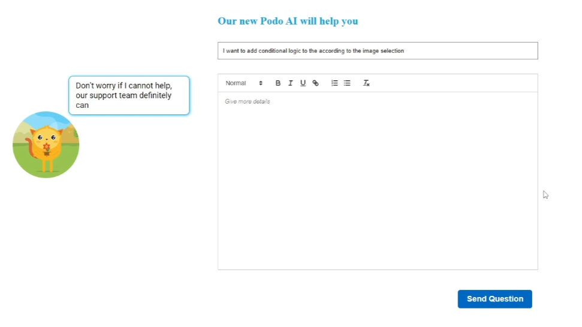
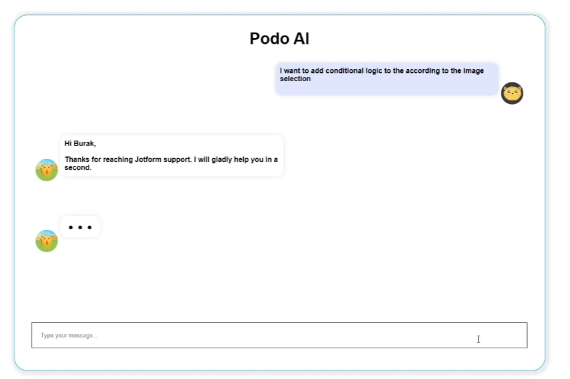

## AI Chatbot
A project for supporting customer service to increase service quality.Provide quick and accurate responses to enhance user experience and automate routine tasks, freeing up human agents for noncomplex time consuming issues.

### Technology Stack:

**Frontend:** Built with **React** for a responsive and dynamic user interface.
**Backend:** **FastAPI** is used to handle the chatbot's API requests efficiently.
**Models:** Employ a **sentence encoder** and a **similarity model** for clustering answers, and a **generative language model** for generating responses.

### App Showcase

  
  

  
---
---

## [Aurora App](https://github.com/BBBakir/aurora)
A project that supports people suffering from addictions for GDSC Solution Challenge

### 🚀 Project Aim

The aim of the application designed to help those with addiction is to provide a supportive and effective tool for individuals struggling with addictive behaviors. The app is intended to serve as a resource for individuals seeking to overcome their addiction by offering them information, guidance, and tools to aid them in their recovery journey. 

### Technology Stack
**Frontend:** **Flutter** 
**Backend:** **Firebase** 

### App Showcase

 

---
---

## [Project S.O.S.](https://github.com/BBBakir/S.O.S)

Course project. Web application demo in order to help donors and those in need of donations during earthquakes. This application facilitates making changes in the database via a user-friendly web interface, leveraging UI and UX elements.

### Technology Stack:
**Frontend:** **HTML, CSS, Bootstrap** \
**Backend:** **Django**  \
**Database:** **SQLite** 

### S.O.S Project Screenshots

  
  

 
---
---

## [LAV Company Route Planner](https://github.com/BBBakir/RoutePlanner)
Vehicle Route planner using OR algorithm and GUI with PyQt6.

### The OR model use page

  
  

